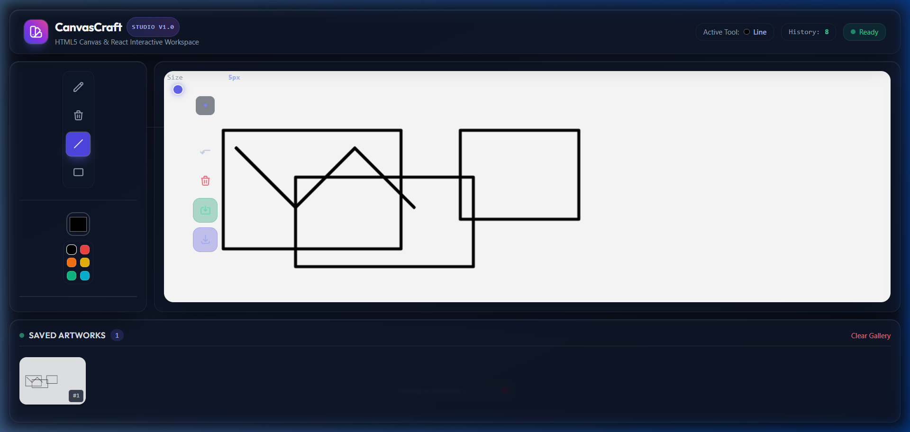

# CanvasCraft — Interactive Drawing Studio

An interactive, responsive drawing application built with React and the HTML5 Canvas API. Designed with a modern glassmorphism aesthetic, CanvasCraft provides smooth freehand sketching, geometric shape tools, full undo history, Local Storage artwork persistence, an interactive gallery, and PNG export capabilities.



---

## Features

- 🖌️ **Creative Drawing Tools**: Freehand Pen with smooth line smoothing (`round` caps & joins).
- 🧹 **Precision Eraser**: Pixel erasure leveraging Canvas `globalCompositeOperation = 'destination-out'`.
- 📐 **Geometric Shapes**: Live bounding-box preview for Line and Rectangle tools.
- 🎨 **Color & Brush Controls**: Native color picker, quick color swatches, and thickness range slider (1px – 50px) with live dot preview.
- ⏪ **Non-Destructive Undo**: Full drawing history stack with instant pixel-buffer restoration.
- 💾 **Client-Side Persistence**: Saves serialized Base64 canvas data into browser `localStorage` (`savedDrawings`).
- 🖼️ **Interactive Gallery**: Saved artworks gallery with instant canvas restoration on click.
- 📥 **High-Resolution PNG Export**: Programmatic one-click artwork download.
- 💎 **Glassmorphism UI**: Frosted glass panels, dynamic glowing accents, and responsive layout across mobile, tablet, and desktop.
- 🧪 **Automated Testing Ready**: Full suite of `data-testid` attributes and global `window.getCanvasDataURL()` test hook.

---

## Tech Stack

- **Framework**: [React 19](https://react.dev/)
- **Build Tool**: [Vite 8](https://vite.dev/)
- **Canvas Subsystem**: HTML5 Canvas 2D Rendering Context
- **Styling**: [Tailwind CSS](https://tailwindcss.com/) with custom glassmorphism utilities
- **Storage**: Browser Web Storage API (`localStorage`)
- **Typography**: Outfit & Plus Jakarta Sans (Google Fonts)

---

## Project Structure

```text
├── docs/
│   ├── README.md               # Documentation hub
│   ├── PROJECT_STRUCTURE.md    # Folder structure breakdown
│   ├── ARCHITECTURE.md         # React + Canvas state decoupling
│   ├── WORKFLOW.md             # Development & drawing pipelines
│   ├── DEPLOYMENT.md           # Render deployment walkthrough
│   ├── FEATURES.md             # Detailed feature catalogue
│   ├── CHANGELOG.md            # Release version history
│   └── images/                 # UI screenshots
├── public/
│   └── favicon.svg             # Application studio icon
├── src/
│   ├── components/
│   │   ├── Canvas.jsx          # Imperative 2D Canvas engine
│   │   ├── Toolbar.jsx         # Tool selection & adjustments
│   │   ├── Gallery.jsx         # Persistent saved artworks strip
│   │   └── Header.jsx          # Branding & status bar
│   ├── App.jsx                 # Central application state orchestrator
│   ├── main.jsx                # React root mount
│   └── index.css               # Design system & Tailwind directives
├── index.html                  # HTML5 entrypoint & fonts
├── tailwind.config.js          # Design tokens & color extensions
├── postcss.config.js           # PostCSS Tailwind integration
├── vite.config.js              # Vite configuration
└── package.json                # Dependencies & scripts
```

---

## Getting Started

### Prerequisites
- Node.js (v18.0.0 or higher)
- npm (v9.0.0 or higher)

### Installation
```bash
# Clone the repository
git clone https://github.com/chdsssbaba/build-interactive-drawing-application-with-react-and-canvas-api.git
cd build-interactive-drawing-application-with-react-and-canvas-api

# Install dependencies
npm install
```

### Running Locally
```bash
npm run dev
```
Open `http://localhost:5173` in your browser.

### Building for Production
```bash
npm run build
```
The optimized production bundle will be generated inside the `dist/` directory.

### Previewing Production Build
```bash
npm run preview
```

---

## Keyboard Shortcuts

| Shortcut | Action |
|---|---|
| `Ctrl + Z` / `Cmd + Z` | Undo most recent stroke |
| `Ctrl + S` / `Cmd + S` | Save current artwork to Local Storage |

---

## Deployment

This project is configured for single-command zero-config deployment on **Render Static Sites**:

- **Build Command**: `npm run build`
- **Publish Directory**: `dist`

For step-by-step instructions, see the [Render Deployment Guide](docs/DEPLOYMENT.md).

---

## Credits

Crafted by **chdsssbaba** (`chdsssbaba5@gmail.com`).
Designed with modern web standards and HTML5 Canvas APIs.
