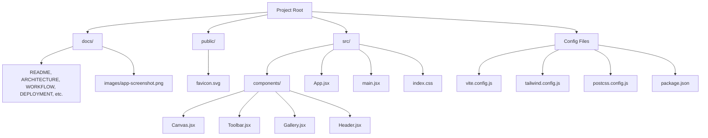

# Project Structure

This document outlines the organization and directory structure of the CanvasCraft application.

---

## Directory & File Details

### `/docs`
Houses all architectural, operational, and development documentation:
- `README.md`: Central documentation directory.
- `PROJECT_STRUCTURE.md`: Current document detailing directory relationships.
- `ARCHITECTURE.md`: Deep dive into state management, refs, and canvas rendering.
- `WORKFLOW.md`: Drawing lifecycle, event flows, and state machines.
- `DEPLOYMENT.md`: Step-by-step Render deployment configurations.
- `FEATURES.md`: Granular breakdown of supported tools and controls.
- `CHANGELOG.md`: Development iterations and milestone commits.
- `images/`: High-resolution UI screenshots and visual assets.

### `/public`
Contains static public assets served verbatim by Vite:
- `favicon.svg`: Custom SVG studio brandmark.

### `/src`
Application source code:
- `components/Canvas.jsx`: Core canvas engine. Manages DOM canvas references, 2D context configuration, mouse/touch drawing loops, live shape previews, and global test hooks.
- `components/Toolbar.jsx`: Interactive tool selection (Pen, Eraser, Line, Rectangle), native HTML color picker, brush thickness range slider, and quick action buttons.
- `components/Gallery.jsx`: Saved drawings container. Fetches, renders, and enables one-click restoration of artworks from Local Storage.
- `components/Header.jsx`: Studio header bar displaying title, status indicators, and active tool telemetry.
- `App.jsx`: Top-level component holding application state, history stack, and orchestrating interactions between the Canvas, Toolbar, and Gallery.
- `main.jsx`: React 19 entry point mounting the root component into `#root`.
- `index.css`: Tailwind layer directives, custom glassmorphism classes, animations, and custom range slider styling.

### Root Configuration
- `index.html`: Web page shell containing Google Fonts references and responsive viewport definitions.
- `vite.config.js`: Fast Vite build configuration with React plugin.
- `tailwind.config.js`: Custom color palette and glassmorphism design tokens.
- `postcss.config.js`: PostCSS configuration for Tailwind and Autoprefixer.
- `package.json`: NPM package metadata, scripts, and dependencies.
