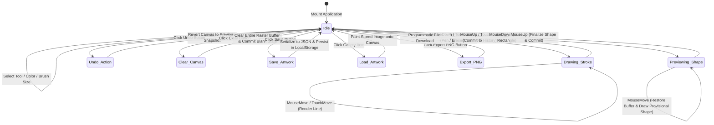
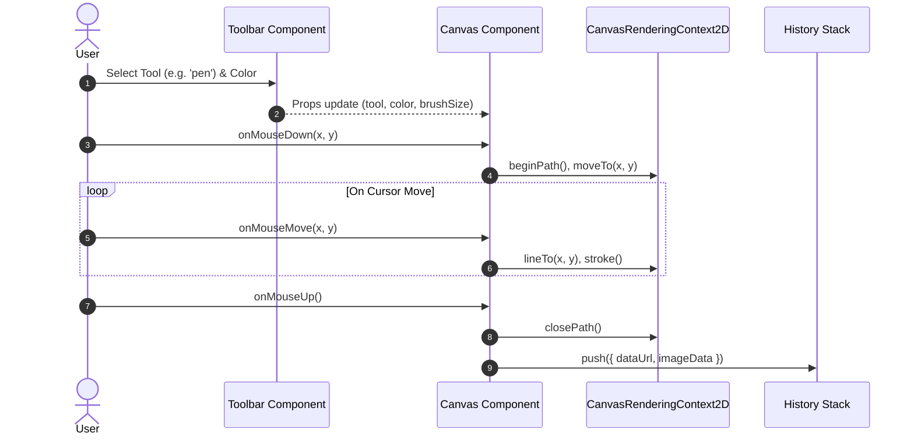

# Application Workflow

This document details the user interactions, drawing event loops, and persistence lifecycles of CanvasCraft.

---

## User Interaction Flow

---

## Drawing Event Loop

---

## LocalStorage Persistence Flow

1. **Initial Mount**:
   - `App.jsx` reads key `'savedDrawings'` via `localStorage.getItem()`.
   - Content is deserialized via `JSON.parse()`.
   - Gallery renders thumbnail cards for all retrieved entries.
2. **Save Action**:
   - User clicks `button[data-testid="save-storage-button"]`.
   - Active canvas is serialized to a standard PNG Base64 Data URL via `canvas.toDataURL('image/png')`.
   - Current list is retrieved from `localStorage`, updated with the new artwork string, and persisted back via `localStorage.setItem('savedDrawings', JSON.stringify(list))`.
   - State is updated reactively, immediately populating the gallery.
3. **Artwork Restoration**:
   - User clicks `button[data-testid="gallery-item-0"]`.
   - Serialized image is assigned to a native `Image` object.
   - Canvas context is cleared and `context.drawImage(img, 0, 0)` repaints the artwork in 100% pixel fidelity.
